# Architecture

ChartGPU follows a **functional-first architecture**:

- **Core rendering**: Functional APIs in `GPUContext`, `RenderScheduler`
- **Chart API**: `ChartGPU.create()` factory pattern
- **Options**: Deep-merge resolution via `resolveOptions()`
- **Renderers**: Internal pipeline-based renderers for each series type
- **Interaction**: Event-driven with render-on-demand scheduling
- **Render modes**: `'auto'` (internal rAF loop) or `'external'` (application-driven via `renderFrame()`)
- **Render coordinator**: Modular architecture with 11 specialized modules under `src/core/renderCoordinator/` (see [INTERNALS.md](api/INTERNALS.md))
- **Pipeline cache**: Optional shared `PipelineCache` for deduplicating shader modules, render pipelines, and compute pipelines across charts on the same device
- **GPU frame graph**: Compute (scatter density + line decimation) → main scene **4× MSAA** resolve → optional dense-hairline **sampleCount:1** → overlay **4× MSAA** (blit + annotations + axes/crosshair/highlight); one `queue.submit` per frame via `submitBatcher`

## Architecture Diagram

At a high level, `ChartGPU.create(...)` owns the canvas + WebGPU lifecycle, and delegates render orchestration (layout/scales/data upload/frame encode + internal overlays) to the render coordinator. Charts can render via an internal `requestAnimationFrame` loop (`'auto'` mode, the default), or be driven externally by calling `renderFrame()` from an application-controlled loop (`'external'` mode).

Default MSAA is main **4×** / overlay **4×** (`antialias: true` at create). When `antialias: false`, both passes use `sampleCount: 1`. High-N line series may additionally draw in a **dense hairline** pass (`sampleCount: 1` on the resolve texture) between main resolve and the overlay pass — planned by `render/frameRender.ts`.

```mermaid
flowchart TB
  UserApp["Consumer app"] --> PublicAPI["src/index.ts - Public API exports"]

  PublicAPI --> ChartCreate["ChartGPU.create(container, options, context?)"]
  PublicAPI --> SyncAPI["connectCharts(charts)"]
  PublicAPI --> PipelineCacheCreate["createPipelineCache(device)"]

  PipelineCacheCreate -. "optional" .-> ChartCreate

  subgraph MainThread["Main Thread Rendering - Default"]
    subgraph ChartInstance["Chart instance - src/ChartGPU.ts"]
      ChartCreate --> SupportCheck["checkWebGPUSupport()"]
      ChartCreate --> Canvas["Create canvas + mount into container"]
      ChartCreate --> Options["resolveOptionsForChart(options) - adds bottom reserve when slider present"]
      ChartCreate --> GPUInit["GPUContext.create(canvas)"]
      ChartCreate --> Coordinator["createRenderCoordinator(gpuContext, resolvedOptions, callbacks?)"]

      ChartCreate --> InstanceAPI["ChartGPUInstance APIs"]
      InstanceAPI --> RequestRender["requestAnimationFrame - coalesced (auto mode)"]
      RequestRender --> Coordinator
      InstanceAPI --> RenderFrame["renderFrame() - encode sync; submit microtask-batched (external mode)"]
      RenderFrame --> Coordinator

      InstanceAPI --> SetOption["setOption(...)"]
      InstanceAPI --> AppendData["appendData(...) - XYArraysData, InterleavedXYData, DataPoint"]
      InstanceAPI --> Resize["resize()"]
      InstanceAPI --> SetRenderMode["setRenderMode('auto' | 'external')"]
      InstanceAPI --> NeedsRender["needsRender() - dirty flag"]

      subgraph PublicEvents["Public events + hit-testing"]
        Canvas --> PointerHandlers["Pointer listeners"]
        PointerHandlers --> PublicHitTest["findNearestPoint / findPieSlice - visibility filtering"]
        PointerHandlers --> EmitEvents["emit click / mouseover / mouseout"]
        AppendData --> EmitDataAppend["emit dataAppend"]
      end

      DataZoomSlider["dataZoom slider - DOM overlay, reserves bottom space"] --> Coordinator
    end

    subgraph WebGPUCore["WebGPU core - src/core/GPUContext.ts"]
      GPUInit --> AdapterDevice["navigator.gpu.requestAdapter/device"]
      GPUInit --> CanvasConfig["canvasContext.configure(format)"]
    end

    subgraph RenderCoordinatorLayer["Render coordinator - shell + renderCoordinator/*"]
      subgraph CoordModules["Coordinator modules - src/core/renderCoordinator/*"]
        Impl["createRenderCoordinatorImpl - composition root"]
        Utils["utils/ - Canvas, bounds, axes, time formatting"]
        GPU["gpu/ - Texture management, MSAA targets"]
        RenderersModule["renderers/ - Renderer + decimation pool"]
        DataMods["data/ - Slice, display resolve, append policy, packing xOffset"]
        Zoom["zoom/ - Zoom state utilities"]
        Anim["animation/ - Animation helpers"]
        Interact["interaction/ - Pointer and hit-testing"]
        UI["ui/ - Tooltip and legend helpers"]
        AxisMods["axis/ - Tick computation and labels"]
        Annot["annotations/ - Annotation processing"]
        Render["render/ - frameRender pass graph, series prepare/draw, overlays"]
      end

      Coordinator --> CoordModules

      PipelineCacheCreate -. "optional" .-> Coordinator
      Coordinator -. "forwards pipelineCache" .-> RenderersModule
      Coordinator -. "forwards pipelineCache" .-> GPU

      Coordinator --> Layout["GridArea layout"]
      Coordinator --> Scales["xScale/yScale - clip space for render"]
      Coordinator --> DataUpload["createDataStore(device) - GPU buffer upload/caching"]

      subgraph FrameGraph["GPU frame graph - planGpuFrame / encode"]
        Coordinator --> ComputePasses["Compute: scatter density + line decimation"]
        PipelineCacheCreate -. "caches compute pipelines" .-> ComputePasses
        ComputePasses --> MainPass["Main scene pass - 4× MSAA series + grid"]
        PipelineCacheCreate -. "caches render pipelines" .-> MainPass
        MainPass --> Resolve["Resolve to mainResolveTexture"]
        Resolve --> HairlinePass["Optional dense hairline - sampleCount 1"]
        HairlinePass --> OverlayPass["Overlay pass - 4× MSAA blit + annotations + axes/UI"]
        Resolve -.->|"no dense hairline"| OverlayPass
        OverlayPass --> Submit["submitBatcher - one queue.submit"]
      end

      subgraph InternalOverlays["Internal interaction overlays"]
        Coordinator --> Events["createEventManager(canvas, gridArea)"]
        Events --> OverlayHitTest["hover/tooltip hit-testing with visibility filtering"]
        Events --> InteractionX["interaction-x state - crosshair"]
        Coordinator --> OverlaysDOM["DOM overlays: legend / tooltip / text labels / annotation labels"]
      end
    end
  end

  subgraph GPURenderers["GPU renderers - src/renderers/*"]
    MainPass --> GridR["Grid"]
    MainPass --> AreaR["Area"]
    MainPass --> BarR["Bar"]
    MainPass --> ScatterR["Scatter"]
    MainPass --> ScatterDensityR["Scatter density/heatmap"]
    MainPass --> LineR["Line - AA quads"]
    HairlinePass --> LineHairline["Line - dense hairline line-list"]
    MainPass --> PieR["Pie"]
    MainPass --> CandlestickR["Candlestick"]
    MainPass --> ReferenceLineR["Reference lines"]
    MainPass --> AnnotationMarkerR["Annotation markers - below"]
    OverlayPass --> AnnotationAbove["Annotation markers - above"]
    OverlayPass --> CrosshairR["Crosshair overlay"]
    OverlayPass --> HighlightR["Hover highlight overlay"]
    OverlayPass --> AxisR["Axes/ticks"]
    ComputePasses --> DecimationC["Decimation compute"]
    ComputePasses --> DensityC["Scatter density compute"]
  end

  subgraph Shaders["WGSL shaders - src/shaders/*"]
    GridR --> gridWGSL["grid.wgsl"]
    AxisR --> gridWGSL
    AreaR --> areaWGSL["area.wgsl"]
    BarR --> barWGSL["bar.wgsl"]
    ScatterR --> scatterWGSL["scatter.wgsl"]
    DensityC --> scatterDensityBinningWGSL["scatterDensityBinning.wgsl"]
    ScatterDensityR --> scatterDensityColormapWGSL["scatterDensityColormap.wgsl"]
    LineR --> lineWGSL["line.wgsl"]
    LineHairline --> lineWGSL
    DecimationC --> decimationWGSL["decimation.wgsl"]
    PieR --> pieWGSL["pie.wgsl"]
    CandlestickR --> candlestickWGSL["candlestick.wgsl"]
    ReferenceLineR --> referenceLineWGSL["referenceLine.wgsl"]
    AnnotationMarkerR --> annotationMarkerWGSL["annotationMarker.wgsl"]
    AnnotationAbove --> annotationMarkerWGSL
    CrosshairR --> crosshairWGSL["crosshair.wgsl"]
    HighlightR --> highlightWGSL["highlight.wgsl"]
  end

  subgraph ChartSync["Chart sync - src/interaction/createChartSync.ts"]
    SyncAPI --> ListenX["listen: crosshairMove"]
    SyncAPI --> DriveX["setCrosshairX(...) on peers"]
    SyncAPI -. "optional" .-> ListenZoom["listen: zoomRangeChange"]
    SyncAPI -. "optional" .-> DriveZoom["setZoomRange(...) on peers"]
  end

  InteractionX --> ListenX
  DriveX --> InstanceAPI

  ExternalCoord["External rAF coordinator (dashboard)"] -.-> NeedsRender
  ExternalCoord -.-> RenderFrame
```

## Key Components

| Component | Location | Responsibility |
|-----------|----------|----------------|
| **ChartGPU** | `src/ChartGPU.ts` | Factory + instance lifecycle, canvas management, public events |
| **GPUContext** | `src/core/GPUContext.ts` | WebGPU adapter/device/context initialization |
| **PipelineCache (optional)** | `src/core/PipelineCache.ts` | Shared cache for `GPUShaderModule`, `GPURenderPipeline`, and `GPUComputePipeline` across charts on the same `GPUDevice` (opt-in via `ChartGPU.create(..., { pipelineCache })`) |
| **Submit batcher** | `src/core/gpu/submitBatcher.ts` | Microtask-coalesced `queue.submit` across charts on the same device |
| **Render Coordinator shell** | `src/core/createRenderCoordinator.ts` | Public factory re-export |
| **Render Coordinator impl** | `src/core/renderCoordinator/createRenderCoordinatorImpl.ts` | Composition root: layout, scales, options, DOM overlays, orchestrates encode |
| **Frame / pass graph** | `src/core/renderCoordinator/render/frameRender.ts` | `planGpuFrame`, compute encode helpers, series pass ownership |
| **Coordinator Modules** | `src/core/renderCoordinator/*` | Domain modules: utils, gpu/textureManager (main 4× / overlay 4× MSAA), renderers (+ decimation pool), data (display resolve / append policy / flush), zoom, animation, interaction, ui, axis, annotations, render (series + overlays) |
| **GPU Renderers** | `src/renderers/*` | Series-type pipelines (main scene @ 4× or 1×); overlay axes/crosshair/highlight/above-annotations @ matching MSAA; optional dense-hairline `line-list` @ sampleCount 1; decimation compute |
| **WGSL Shaders** | `src/shaders/*` | Vertex/fragment/compute shaders (line: screen-space quad expansion + SDF AA; `decimation.wgsl` for GPU sampling; axis shares `grid.wgsl`) |
| **Chart Sync** | `src/interaction/createChartSync.ts` | Multi-chart crosshair and zoom synchronization |
| **Data Store** | `src/data/createDataStore.ts` | GPU buffer upload, caching, geometric growth, ranged append |
| **External Render Mode** | `src/ChartGPU.ts` | `renderFrame()`, `needsRender()`, `setRenderMode()` — application-driven render scheduling for multi-chart dashboards |

## Further Reading

- [INTERNALS.md](api/INTERNALS.md) — Deep internal notes for contributors (data store, renderers, coordinator modules, upload/decimation contracts)
- [Performance Guide](performance.md) — Sampling, GPU decimation, zoom-aware resampling, streaming best practices
- [API Documentation](api/README.md) — Full public API reference
